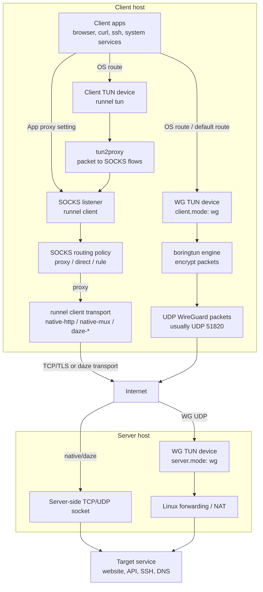

# Runnel

Runnel is a compact Rust proxy and tunnel toolbox. It support a WireGuard-style UDP tunnel built on `boringtun`, and also keeps classic SOCKS and native/daze transports available for app-level proxying.

The project intentionally keeps the moving parts visible:

- `runnel client` runs the WG client when `client.mode: wg`, or
  exposes a local SOCKS5 proxy for native/daze modes.
  - `runnel tun` optionally captures local IP traffic through the classic native-http client path.
- `runnel server` accepts one of several client/server modes.
- config files, daemon mode, status checks, telemetry sockets, and TUI dashboards
  are available from the same binary.

## Modes

Runnel has two separate concerns. Keeping them separate makes the modes easier
to reason about:

1. **Client/server mode**: how `runnel client` talks to `runnel server`.
2. **Client traffic intake**: whether local traffic enters through SOCKS or a
   local TUN device.

### Client/Server Modes

These are the `--mode` values shared by `runnel client` and `runnel server`.

| Mode | Shape | Best for | Main tradeoff |
| --- | --- | --- | --- |
| `wg` | WireGuard-style UDP via `boringtun` | Recommended full-tunnel or split-tunnel mode with real UDP tunnel semantics | Usually needs root or network privileges; automatic true dual-stack still needs more schema work |
| `native-http` | TLS + HTTP-looking per-connection tunnel | Classic SOCKS proxy, compatibility path, UDP ASSOCIATE support | One upstream TCP/TLS connection per SOCKS connection |
| `native-mux` | One long-lived TLS session with logical streams | Many short-lived TCP connections | A single session carries many streams |
| `daze-ashe` | Raw TCP daze-style encrypted stream | Minimal alternate transport | No TLS camouflage |
| `daze-baboon` | HTTP-looking request, then daze-style stream | Daze-style handshake hidden behind a normal-looking request | More specialized than `native-http` |
| `daze-czar` | Raw TCP multiplexed daze-style session | Daze-style multiplexing | More stateful than `daze-ashe` |

### Client Traffic Intake

This decides how traffic reaches the local client side. For native/daze modes,
the intake is conceptually separate from the client/server mode. WG is the
exception: `client.mode: wg` selects the WireGuard-style client/server mode and
also creates its own TUN-based traffic intake.

| Intake | Entry point | What it captures | Current implementation status |
| --- | --- | --- | --- |
| WG TUN | `runnel client` with `client.mode: wg` | System IP traffic routed into the WireGuard-style TUN device | Works with `server.mode: wg`; uses UDP transport via `boringtun` and does not use SOCKS or `runnel tun` |
| SOCKS | `runnel client` with native/daze modes | Apps explicitly configured for `socks5://127.0.0.1:1080` | Works with `native-http`, `native-mux`, and `daze-*` |
| macOS system proxy | `runnel client --system-proxy` | Apps that honor the macOS SOCKS proxy setting | Works with the normal SOCKS client path |
| TUN | `runnel tun` | System IP traffic routed into a local TUN device | Architecturally a client-side intake mode; currently implemented only with `native-http` because DNS/UDP handling relies on SOCKS `UDP ASSOCIATE` |



Sample config files live in [`config/`](./config/). They use documentation-only
hosts, addresses, and placeholders; bring your own `RUNNEL_PASSWORD`, certificates,
and WG keys.

## Install And Build

```bash
cargo build --release
```

During development you can replace `./target/release/runnel` with:

```bash
cargo run -- ...
```

## Quick Start: WG Mode

WG mode is the recommended path for daily use. It is a WireGuard-style tunnel
built on `boringtun`, uses UDP between `runnel client` and `runnel server`, and
supports full-tunnel or split-tunnel routing. It does not use SOCKS,
`runnel tun`, or the native/daze handshakes.

Generate a paired config, replacing `SERVER-IP` with the real server IP before
running the command:

```bash
./target/release/runnel wg-config \
  --server-endpoint SERVER-IP:51820 \
  --client-tunnel-ip 10.8.0.2 \
  --server-tunnel-ip 10.8.0.1 \
  --dns 1.1.1.1 \
  --dns-capture \
  --direct-ip "10.*" \
  --direct-ip "172.16.0.0/12" \
  --direct-ip "192.168.*" \
  --nat-out-interface eth0 > runnel.wg.yaml
```

There are also shape-only templates at
[`config/wg-ipv4.yaml`](./config/wg-ipv4.yaml) and
[`config/wg-ipv6.yaml`](./config/wg-ipv6.yaml). Prefer `wg-config` for real
deployments so each client/server pair gets fresh keys.
Generated WG configs enable `client.adblock` by default with EasyList,
EasyPrivacy, and uBlock filters; set `client.adblock.enabled: false` if you do
not want DNS-level ad blocking.

Start the server first:

```bash
sudo ./target/release/runnel \
  --log-file /tmp/runnel-wg-server.log \
  --config runnel.wg.yaml \
  server
```

Start the client second:

```bash
sudo ./target/release/runnel \
  --log-file /tmp/runnel-wg-client.log \
  --config runnel.wg.yaml \
  --tui \
  client
```

Preview hooks without changing the system:

Temporarily add these fields under the side you want to inspect:

```yaml
client:
  wg:
    print_hooks: true
    dry_run: true

server:
  wg:
    print_hooks: true
    dry_run: true
```

Then run the normal entry point:

```bash
./target/release/runnel \
  --log-file /tmp/runnel-wg-client-dry-run.log \
  --config runnel.wg.yaml \
  client

./target/release/runnel \
  --log-file /tmp/runnel-wg-server-dry-run.log \
  --config runnel.wg.yaml \
  server
```

Remove `dry_run: true` before real startup.

Run a repeatable smoke check:

```bash
# server machine
sudo ./scripts/runnel-wg-smoke.sh --role server --config runnel.wg.yaml --start

# client machine
sudo ./scripts/runnel-wg-smoke.sh --role client --config runnel.wg.yaml --start
```

WG mode notes:

- Startup preflight checks privileges and platform tools before hooks run.
- The WG client sends a short startup handshake probe before creating the
  device, so unreachable endpoints or mismatched WG keys fail with a clear
  error. Use `client.wg.skip_handshake_probe: true` only when starting before
  the server is reachable is intentional.
- The WG server watches for a first successful handshake and warns after 30s if
  none is observed; set `server.wg.handshake_watchdog_secs: 0` for intentionally
  idle servers.
- Linux server NAT defaults to IPv4 `iptables` masquerade.
- macOS client DNS capture uses a local UDP DNS forwarder on `127.0.0.1:53`.
- TUI can show aggregate WG traffic; Recent Domains require `--dns-capture`.
- IPv4-only and IPv6-only automatic hooks are supported. True dual-stack still
  needs a schema extension with separate IPv4 and IPv6 tunnel address pairs.
- More detail lives in [`docs/wg.md`](./docs/wg.md).

## Optional: SOCKS Proxy

Use the classic SOCKS path when you want app-level proxying instead of a
system-level WG tunnel.

Generate a certificate for the server name:

```bash
./target/release/runnel cert \
  --name example.com \
  --cert server.crt \
  --key server.key
```

Start the server:

```bash
RUNNEL_PASSWORD='replace-me' ./target/release/runnel server \
  --mode native-http \
  --listen 0.0.0.0:1443 \
  --cert server.crt \
  --key server.key
```

Start the local client:

```bash
RUNNEL_PASSWORD='replace-me' ./target/release/runnel client \
  --mode native-http \
  --listen 127.0.0.1:1080 \
  --server example.com:1443 \
  --server-name example.com \
  --ca-cert server.crt
```

Point your browser or CLI tools at:

```text
socks5://127.0.0.1:1080
```

## Optional: Native TUN Intake

`runnel tun` is the TUN intake for the classic native-http client path. Prefer WG
for VPN-style daily use; use `runnel tun` when you specifically need the
native-http SOCKS pipeline behind a TUN device.

Use a tun-specific config such as [`config/tun.yaml`](./config/tun.yaml):

```bash
sudo RUNNEL_PASSWORD='replace-me' ./target/release/runnel \
  --config ./config/tun.yaml \
  tun
```

Preview hooks before touching routes:

```bash
./target/release/runnel --config ./config/tun.yaml tun --dry-run
```

Useful helper:

```bash
./scripts/runnel-tun.sh doctor
sudo ./scripts/runnel-tun.sh reset
sudo ./scripts/runnel-tun.sh reset --dry-run
```

Important limits:

- `tun` is conceptually independent from the client/server transport, but the
  current implementation requires `client.mode: native-http`.
- `tun` ignores `client.system_proxy`; traffic is already captured by the TUN.
- Default route and DNS hooks usually require `sudo`.
- Direct/rule routing can loop back into the TUN, so `tun` forces
  `client.filter: proxy`.

## SOCKS Split Routing And Proxy Control

The SOCKS client can decide per target whether to connect directly, proxy
remotely, or block.

Inline YAML rules are the preferred format:

```yaml
client:
  mode: native-http
  domain_rules:
    direct:
      - "*.qq.com"
      - "*.cn"
    block:
      - "*.xxx.com"
  ip_rules:
    direct:
      - "128.33.*"
      - "0.3.0.2/16"
    block:
      - "12.9.*.0"
  adblock:
    enabled: true
    lists:
      - ~/.config/runnel/easylist.txt
      - https://easylist.to/easylist/easyprivacy.txt
    cache_dir: ~/.cache/runnel/adblock
    update_interval_hours: 24
    decision_cache_ttl_secs: 300
    fail_open: true
```

`domain_rules` use case-insensitive glob matching. A pattern like `*.qq.com`
matches both `qq.com` and subdomains such as `img.qq.com`. `ip_rules` accept
CIDRs, IP literals, and IPv4 wildcards: `128.33.*` becomes `128.33.0.0/16`,
`128.33.2.*` becomes `128.33.2.0/24`, and `12.9.*.0` expands to the matching
host routes. Inline rules automatically enable `client.filter: rule` unless
`client.filter` is explicitly set. Put rule blocks under `client:` because they
describe client-side routing behavior. Quote wildcard patterns in YAML because
unquoted `*` starts a YAML alias. If `client.filter` is explicitly set to
`proxy` or `direct`, only `block` rules are still honored.

`client.adblock` loads ABP/uBlock-style network filter lists. Set
`enabled: false` to keep subscriptions in config but disable adblock. If
`enabled` is omitted, adblock turns on automatically when `lists` is non-empty.
Local files are read directly; HTTP(S) subscriptions are cached under
`cache_dir` and refreshed after `update_interval_hours`. Adblock decisions are
cached in memory for `decision_cache_ttl_secs`. The routing priority is: user `block` rules,
adblock block rules, user `direct`/`proxy` rules, then the default proxy path.
With `fail_open: true`, broken subscriptions are skipped so startup does not
fail just because a list server is unavailable.

```bash
RUNNEL_PASSWORD='replace-me' ./target/release/runnel client \
  --mode native-http \
  --listen 127.0.0.1:1080 \
  --server example.com:1443 \
  --server-name example.com \
  --ca-cert server.crt \
  --filter rule \
  --rule-file ./rule.ls \
  --cidr-file ./rule.cidr
```

Filter modes:

- `--filter proxy`: always use the remote proxy. This is the default.
- `--filter direct`: always connect directly from the client machine.
- `--filter rule`: evaluate block rules, adblock rules, direct/proxy rules, then
  fall back to remote.

Example `rule.ls`:

```text
L *.lan *.local printer.home
R *.example.com
B ads.example.net
```

Example `rule.cidr`:

```text
L 192.168.0.0/16
R 1.1.1.0/24
B 203.0.113.0/24
```

Native HTTP, native mux, and Daze client modes use the same rule engine. `tun`
currently forces `client.filter: proxy` to avoid direct-route loops, so direct
rules are not used there, but block rules still apply. WG mode can map common
`ip_rules.direct` entries to WG route exclusions while keeping proxy as the
default route. WG also supports `domain_rules` through DNS capture:
`domain_rules.direct` installs dynamic direct host routes for resolved A/AAAA
records, `domain_rules.block` returns NXDOMAIN, and `domain_rules.proxy` keeps
the default tunnel behavior. In WG mode `client.adblock` also runs from DNS
capture and returns NXDOMAIN for blocked domains. WG `ip_rules.block` still
needs firewall or blackhole-route hooks and is not enforced yet.

## Config Files

Most CLI flags can move into YAML and be loaded with `--config`.

```bash
./target/release/runnel \
  --config runnel.wg.yaml \
  client
```

If `--config` is omitted, `runnel` loads the first existing default config:

1. `~/.runnel/config.yaml`
2. `$XDG_CONFIG_HOME/runnel/config.yaml`
3. `~/.config/runnel/config.yaml`
4. `~/Library/Application Support/runnel/config.yaml` on macOS
5. the original sudo user's matching home config paths, when running through `sudo`
6. `/etc/runnel/config.yaml` on Unix

You can also set `RUNNEL_CONFIG=/path/to/config.yaml`. Working-directory config
files are not loaded implicitly because configs can contain hook commands.

Config precedence:

1. explicit CLI flags
2. environment variables
3. YAML config
4. built-in defaults

Relative paths inside YAML are resolved relative to the config file.

Starter files:

- WG mode samples:
  [`config/wg-ipv4.yaml`](./config/wg-ipv4.yaml) and
  [`config/wg-ipv6.yaml`](./config/wg-ipv6.yaml).
- Client/server transport samples:
  [`config/native-http.yaml`](./config/native-http.yaml),
  [`config/native-mux.yaml`](./config/native-mux.yaml),
  [`config/daze-ashe.yaml`](./config/daze-ashe.yaml),
  [`config/daze-baboon.yaml`](./config/daze-baboon.yaml), and
  [`config/daze-czar.yaml`](./config/daze-czar.yaml).
- Client intake sample:
  [`config/tun.yaml`](./config/tun.yaml), currently paired with
  `client.mode: native-http`.
- [`config/README.md`](./config/README.md) explains the templates and key/password policy.

## Daemon, Status, And TUI

Run supported service commands in the background:

```bash
sudo ./target/release/runnel --daemon \
  --log-file ./runnel-wg-server.log \
  --telemetry-sock ./runnel-wg-server.sock \
  --config runnel.wg.yaml \
  server

sudo ./target/release/runnel --daemon \
  --log-file ./runnel-wg-client.log \
  --telemetry-sock ./runnel-wg-client.sock \
  --config runnel.wg.yaml \
  client
```

Check status:

```bash
./target/release/runnel status
./target/release/runnel status client
./target/release/runnel status server
./target/release/runnel status --json
```

Stop a daemon:

```bash
./target/release/runnel stop client
```

Attach a dashboard:

```bash
./target/release/runnel tui --attach ./runnel-wg-client.sock
```

Daemon mode is supported for `client`, `server`, and `tun`. If `--tui` is also
set, daemon mode disables the inline TUI.

## Optional: macOS System Proxy

For the SOCKS client, macOS can temporarily point the system SOCKS proxy at the
local listener and restore it on normal shutdown:

```bash
RUNNEL_PASSWORD='replace-me' ./target/release/runnel client \
  --mode native-http \
  --listen 127.0.0.1:1080 \
  --server example.com:1443 \
  --server-name example.com \
  --ca-cert server.crt \
  --system-proxy
```

Limit the affected network services by repeating `--system-proxy-service`.

## Security Notes

- Prefer environment variables over putting shared secrets in shell history.
- Keep WG private keys in local config files only; do not commit real keys.
- Native modes require `--cert` and `--key` on the server.
- Native clients verify TLS certificates by default.
- Self-signed deployments should pass the server certificate with `--ca-cert`.
- Authentication includes timestamp and nonce replay protection.
- Literal private IP targets are blocked unless `--allow-private-targets` is set
  on the server.
- `--fallback-url` controls what unmatched native/daze-baboon requests see.
- TUN and WG route hooks usually require root or equivalent network privileges.

## Architecture Notes

- Overall architecture: [`docs/arch.md`](./docs/arch.md)
- WG mode quickstart: [`docs/wg.md`](./docs/wg.md)

## Development

```bash
cargo check
cargo test
cargo build --release
```
