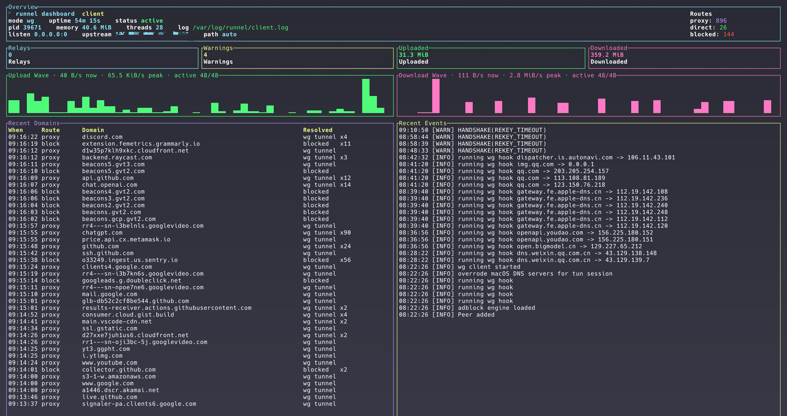

# Runnel

`Runnel` is a compact proxy and tunnel toolbox for daily use, experimentation, and learning.

While `Runnel` supports 5 [proxy modes](./docs/arch.md), its recommended daily-use path is **WG mode**: a [WireGuard](https://www.wireguard.com/) tunnel built on [`boringtun`](https://github.com/cloudflare/boringtun), with TUN routes, DNS
capture, split routing, ad blocking, status checks, and a TUI in one binary.



## Install

Install from crates.io:

```bash
cargo install runnel-rs
```
Or download a prebuilt binary from the [releases page](https://github.com/chenyukang/runnel/releases)

Or build from source:

```bash
cargo build --release
./target/release/runnel --help
```

## Quick Start

WG mode needs one public UDP endpoint on the server, generate one paired config for client and server:

```bash
runnel wg-config --server-endpoint SERVER-IP:1443 > runnel.yaml
```

Replace `SERVER-IP` before running the command. Copy the same
`runnel.yaml` to the server and the client. The file contains both
`server.wg` and `client.wg`, so both sides use the same file.

Open the server firewall or cloud security group for the chosen UDP port, then
start the server (add `--daemon` if you want to run in the background):

```bash
sudo runnel --config runnel.yaml server
```

Start the client (add `--daemon` if you want to run in the background):

```bash
sudo runnel --config runnel.yaml client --tui
```

With no `--log-file`, these write to `/var/log/runnel/server.log` and
`/var/log/runnel/client.log`.

Check the tunnel:

```bash
ping 10.8.0.1
curl --connect-timeout 5 https://1.1.1.1/
```

## Useful Settings

Generated configs enable `client.adblock` by default with EasyList,
EasyPrivacy, and uBlock filters. Disable it if you only want tunneling:

```yaml
client:
  adblock:
    enabled: false
```

Domain rules and IP rules:

```yaml
client:
  domain_rules:
    direct:
      - "*.cn"
      - "*.qq.com"
    block:
      - "*.example-ads.test"
  ip_rules:
    direct:
      - "10.*"
      - "172.16.0.0/12"
      - "192.168.*"
```

On Linux servers, set the outbound interface used for NAT:

```yaml
server:
  wg:
    nat_out_interface: eth0
```

More WG details, including dry-run hooks and DNS behavior, live in
[`docs/wg.md`](./docs/wg.md).

WG mode defaults to boringtun's device engine. There is also an experimental
low-level noise engine for transport experiments. Its optional `mask`
obfuscation wraps WireGuard UDP packets in a keyed frame with random padding;
enable it on both sides:

```yaml
client:
  wg:
    engine: noise
    obfs: mask

server:
  wg:
    engine: noise
    obfs: mask
```

## Daily Commands

Config lookup order, daemon mode, status, stop, and TUI are shared by all modes:

```bash
sudo runnel --config runnel.yaml client
sudo runnel --config runnel.yaml server --daemon
sudo runnel reload
sudo runnel stop
runnel status
runnel tui
```

If `--log-file` is omitted, service commands use role-specific files:
`/var/log/runnel/client.log`, `/var/log/runnel/server.log`, and
`/var/log/runnel/tun.log`.

If `--config` is omitted, Runnel searches the normal user config locations such
as `~/.runnel/config.yaml`, `$XDG_CONFIG_HOME/runnel/config.yaml`,
`~/.config/runnel/config.yaml`, macOS Application Support, sudo user's config
paths, and `/etc/runnel/config.yaml`. You can also set
`RUNNEL_CONFIG=/path/to/config.yaml`.

## Troubleshooting WG Startup

The client performs a short handshake probe before it installs routes. Keep
`client.wg.skip_handshake_probe: false` unless you intentionally need to start
before the server is reachable.

If the probe times out, check the basics first:

```bash
# macOS: make sure the endpoint route uses the real network interface
route -n get SERVER-IP

# Linux
ip route get SERVER-IP
```

The WG endpoint must not route through another VPN or a stale tunnel interface.
For built-in packet evidence in the TUI/status monitor, enable tcpdump events
on one or both sides:

```yaml
client:
  wg:
    tcpdump: true
    tcpdump_interface: any

server:
  wg:
    tcpdump: true
    tcpdump_interface: eth0
```

The monitor records packet direction, UDP length, and likely WG packet type,
such as `handshake-init` and `handshake-response`.

## Other Modes

Runnel also keeps app-level SOCKS proxying and alternate transports:
`native-http`, `native-mux`, `daze-ashe`, `daze-baboon`, `daze-czar`, plus the
classic `runnel tun` intake that feeds the SOCKS pipeline. These are useful when
you want browser/app proxying instead of a full WG-style packet tunnel.

Read [`docs/arch.md`](./docs/arch.md) for the mode matrix, traffic intake
diagram, SOCKS/TUN notes, daemon/status behavior, and config precedence.
Template configs live in [`config/`](./config/), with more notes in
[`config/README.md`](./config/README.md).

## Security Notes

- Keep WG private keys in local config files only; do not commit real keys.
- Prefer environment variables over putting shared secrets in shell history.
- Native modes require server certificates and client certificate verification.
- TUN and WG route hooks usually require root or equivalent network privileges.

## Development

```bash
cargo check
cargo test
cargo build --release
```
