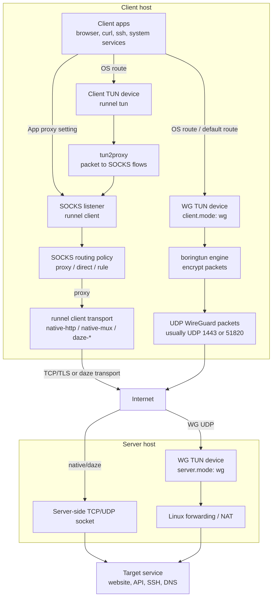

# `runnel` Architecture

`runnel` has one core shape: local application traffic is collected on the
client side, carried to a `runnel server`, and then connected to the final
destination from the server side.

There are two separate choices:

1. Client/server mode: how `runnel client` talks to `runnel server`.
2. Client traffic intake: how local traffic enters the client side.

WG mode combines both choices. `client.mode: wg` uses a WireGuard-style UDP
transport and creates its own TUN intake. Native and
[daze](https://github.com/libraries/daze) modes normally expose a
SOCKS listener; `runnel tun` can put a classic TUN intake in front of the native
HTTP SOCKS pipeline.

## Client/Server Modes

These are the `--mode` values shared by `runnel client` and `runnel server`.

| Mode | Shape | Best for | Main tradeoff |
| --- | --- | --- | --- |
| `wg` | WireGuard-style UDP via `boringtun` | Recommended full-tunnel or split-tunnel mode with real packet tunnel semantics | Usually needs root or network privileges; true automatic dual-stack still needs more schema work |
| `native-http` | TLS + HTTP-looking per-connection tunnel | Classic SOCKS proxy, compatibility path, UDP ASSOCIATE support | One upstream TCP/TLS connection per SOCKS connection |
| `native-mux` | One long-lived TLS session with logical streams | Many short-lived TCP connections | A single session carries many streams |
| `daze-ashe` | Raw TCP [daze](https://pkg.go.dev/github.com/mohanson/daze)-style encrypted stream | Minimal alternate transport | No TLS camouflage |
| `daze-baboon` | HTTP-looking request, then daze-style stream | Daze-style handshake hidden behind a normal-looking request | More specialized than `native-http` |
| `daze-czar` | Raw TCP multiplexed daze-style session | Daze-style multiplexing | More stateful than `daze-ashe` |

## Client Traffic Intake

| Intake | Entry point | What it captures | Current implementation status |
| --- | --- | --- | --- |
| WG TUN | `runnel client` with `client.mode: wg` | System IP traffic routed into the WireGuard-style TUN device | Works with `server.mode: wg`; uses UDP transport via `boringtun` and does not use SOCKS or `runnel tun` |
| SOCKS | `runnel client` with native/daze modes | Apps explicitly configured for `socks5://127.0.0.1:1080` | Works with `native-http`, `native-mux`, and `daze-*` |
| macOS system proxy | `runnel client --system-proxy` | Apps that honor the macOS SOCKS proxy setting | Works with the normal SOCKS client path |
| TUN | `runnel tun` | System IP traffic routed into a local TUN device | Architecturally a client-side intake mode; currently implemented only with `native-http` because DNS/UDP handling relies on SOCKS `UDP ASSOCIATE` |



## Reading The Diagram

SOCKS mode is application-proxy based. An app connects to the local SOCKS
listener exposed by `runnel client`; `runnel` then applies routing policy.
Remote traffic goes through one of the client/server transports, such as
`native-http`, `native-mux`, `daze-ashe`, `daze-baboon`, or `daze-czar`.

Client TUN mode is a client-side capture layer in front of the SOCKS pipeline.
`runnel tun` receives packets from a TUN device, uses `tun2proxy` to turn them
into SOCKS-style flows, and then sends those flows through the normal
`runnel client` path.

WG mode is packet-tunnel based. The OS sends matching routes into the WG TUN
device; `boringtun` encrypts those packets into UDP and sends them to the
server. The server decrypts them, injects them into its WG TUN side, and Linux
forwarding/NAT carries them to the target service.

## Native And Daze SOCKS Path

Use this path when you want app-level proxying instead of a system-level WG
tunnel.

Generate a certificate for the server name:

```bash
runnel cert \
  --name example.com \
  --cert server.crt \
  --key server.key
```

Start a `native-http` server:

```bash
RUNNEL_PASSWORD='replace-me' runnel server \
  --mode native-http \
  --listen 0.0.0.0:1443 \
  --cert server.crt \
  --key server.key
```

Start a local SOCKS client:

```bash
RUNNEL_PASSWORD='replace-me' runnel client \
  --mode native-http \
  --listen 127.0.0.1:1080 \
  --server example.com:1443 \
  --server-name example.com \
  --ca-cert server.crt
```

Point apps at:

```text
socks5://127.0.0.1:1080
```

`native-mux` and `daze-*` share the same local SOCKS intake but use different
client/server transports.

## Native TUN Intake

`runnel tun` is the TUN intake for the classic native HTTP client path. Prefer
WG for VPN-style daily use; use `runnel tun` when you specifically need the
native HTTP SOCKS pipeline behind a TUN device.

Use a tun-specific config such as [`config/tun.yaml`](../config/tun.yaml):

```bash
sudo RUNNEL_PASSWORD='replace-me' runnel \
  --config ./config/tun.yaml \
  tun
```

Preview hooks before touching routes:

```bash
runnel --config ./config/tun.yaml tun --dry-run
```

Useful helper:

```bash
./scripts/runnel-tun.sh doctor
sudo ./scripts/runnel-tun.sh reset
sudo ./scripts/runnel-tun.sh reset --dry-run
```

Important limits:

- `tun` is conceptually independent from the client/server transport, but the
  current implementation requires `client.mode: native-http`.
- `tun` ignores `client.system_proxy`; traffic is already captured by the TUN.
- Default route and DNS hooks usually require `sudo`.
- Direct/rule routing can loop back into the TUN, so `tun` forces
  `client.filter: proxy`.

## Routing And Filtering

Native HTTP, native mux, and daze client modes use the SOCKS rule engine. The
client can connect directly, proxy remotely, or block per target.

Inline YAML rules are the preferred format:

```yaml
client:
  mode: native-http
  domain_rules:
    direct:
      - "*.qq.com"
      - "*.cn"
    block:
      - "*.xxx.com"
  ip_rules:
    direct:
      - "128.33.*"
      - "0.3.0.2/16"
    block:
      - "12.9.*.0"
  adblock:
    enabled: true
    lists:
      - ~/.config/runnel/easylist.txt
      - https://easylist.to/easylist/easyprivacy.txt
    cache_dir: ~/.runnel/cache/adblock
    update_interval_hours: 24
    decision_cache_ttl_secs: 300
    fail_open: true
```

`domain_rules` use case-insensitive glob matching. A pattern like `*.qq.com`
matches both `qq.com` and subdomains such as `img.qq.com`. `ip_rules` accept
CIDRs, IP literals, and IPv4 wildcards. Quote wildcard patterns in YAML because
unquoted `*` starts a YAML alias.

Inline rules automatically enable `client.filter: rule` unless `client.filter`
is explicitly set. If `client.filter` is explicitly set to `proxy` or `direct`,
only `block` rules are still honored.

Filter modes:

- `--filter proxy`: always use the remote proxy. This is the default.
- `--filter direct`: always connect directly from the client machine.
- `--filter rule`: evaluate block rules, adblock rules, direct/proxy rules, then
  fall back to remote.

WG mode uses the same `ip_rules` and `domain_rules` shapes with different
effects. `ip_rules.direct` becomes local-route exclusions from the default
tunnel route. `domain_rules.direct` installs dynamic direct host routes for
resolved A/AAAA records, `domain_rules.block` returns NXDOMAIN from DNS capture,
and `domain_rules.proxy` keeps the default tunnel behavior. WG `ip_rules.block`
still needs firewall or blackhole-route hooks and is not enforced yet.

## Config Files

Most CLI flags can move into YAML and be loaded with `--config`.

```bash
runnel --config runnel.wg.yaml client
```

If `--config` is omitted, `runnel` loads the first existing default config:

1. `~/.runnel/config.yaml`
2. `$XDG_CONFIG_HOME/runnel/config.yaml`
3. `~/.config/runnel/config.yaml`
4. `~/Library/Application Support/runnel/config.yaml` on macOS
5. the original sudo user's matching home config paths, when running through `sudo`
6. `/etc/runnel/config.yaml` on Unix

You can also set `RUNNEL_CONFIG=/path/to/config.yaml`. Working-directory config
files are not loaded implicitly because configs can contain hook commands.

Config precedence:

1. explicit CLI flags
2. environment variables
3. YAML config
4. built-in defaults

Relative paths inside YAML are resolved relative to the config file.

Starter files:

- WG mode samples:
  [`config/wg-ipv4.yaml`](../config/wg-ipv4.yaml) and
  [`config/wg-ipv6.yaml`](../config/wg-ipv6.yaml).
- Client/server transport samples:
  [`config/native-http.yaml`](../config/native-http.yaml),
  [`config/native-mux.yaml`](../config/native-mux.yaml),
  [`config/daze-ashe.yaml`](../config/daze-ashe.yaml),
  [`config/daze-baboon.yaml`](../config/daze-baboon.yaml), and
  [`config/daze-czar.yaml`](../config/daze-czar.yaml).
- Client intake sample:
  [`config/tun.yaml`](../config/tun.yaml), currently paired with
  `client.mode: native-http`.
- [`config/README.md`](../config/README.md) explains the templates and
  key/password policy.

## Operations

Run supported service commands in the background:

```bash
sudo runnel --daemon \
  --log-file ./runnel-wg-server.log \
  --telemetry-sock ./runnel-wg-server.sock \
  --config runnel.wg.yaml \
  server

sudo runnel --daemon \
  --log-file ./runnel-wg-client.log \
  --telemetry-sock ./runnel-wg-client.sock \
  --config runnel.wg.yaml \
  client
```

Check status:

```bash
runnel status
runnel status client
runnel status server
runnel status --json
```

Stop a daemon:

```bash
runnel stop client
```

Temporarily bypass a running client without stopping the daemon:

```bash
sudo runnel switch client
sudo runnel switch client --bypass
sudo runnel switch client --proxy
```

`switch` preserves the original runtime plan. Switching to `bypass` restores the
macOS system proxy or removes WG client routes/DNS overrides so system traffic
goes directly. Switching back to `proxying` reapplies the same hooks, DNS
override, and route configuration that the daemon started with. Dynamic WG
domain direct host routes are kept across the bypass window and are cleaned up
when the daemon exits.

Attach a dashboard:

```bash
runnel tui --attach ./runnel-wg-client.sock
```

If `--log-file` is omitted, service commands use role-specific log files under
`~/.runnel/logs`, such as `~/.runnel/logs/client.log` and
`~/.runnel/logs/server.log`. Explicit `--log-file` and YAML `log_file` values
still take precedence.

Daemon pid files and telemetry sockets default to `~/.runnel/current`, such as
`~/.runnel/current/client.pid` and `~/.runnel/current/client.sock`. Explicit
`--pid-file`, `--telemetry-sock`, and matching YAML values still take precedence.

Log timestamps default to the machine's local timezone. Set
`--log-timezone utc`, `RUNNEL_LOG_TIMEZONE=+08:00`, or YAML
`log_timezone: Asia/Shanghai` to write timestamps in a preferred timezone.

Daemon mode is supported for `client`, `server`, and `tun`. If `--tui` is also
set, daemon mode disables the inline TUI.

For the SOCKS client, macOS can temporarily point the system SOCKS proxy at the
local listener and restore it on normal shutdown:

```bash
RUNNEL_PASSWORD='replace-me' runnel client \
  --mode native-http \
  --listen 127.0.0.1:1080 \
  --server example.com:1443 \
  --server-name example.com \
  --ca-cert server.crt \
  --system-proxy
```

Limit the affected network services by repeating `--system-proxy-service`.

## Runtime Support

The same operational layer is shared across modes: config loading, daemon pid
files, telemetry sockets, `status`, `stop`, logging, and TUI. Client daemons add
`switch` for runtime traffic bypass. WG mode adds platform hooks for TUN setup,
routes, DNS, forwarding/NAT, and UAPI stats.
