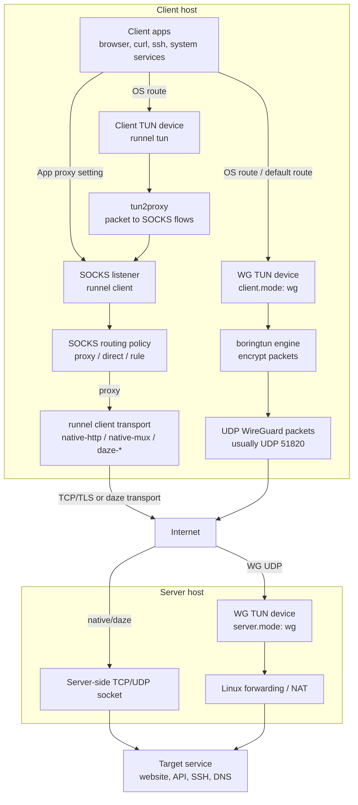

# `runnel` Architecture

`runnel` has one core shape: local application traffic is collected on the
client side, carried to a `runnel server`, and then connected to the final
destination from the server side.

The important choice is how traffic enters the client:

- SOCKS intake: apps explicitly use the local `runnel client` SOCKS listener.
- Client TUN intake: `runnel tun` captures system traffic, then converts it into
  SOCKS flows.
- WG TUN intake: the OS routes traffic into a WireGuard-style TUN device managed
  by `runnel client` in `client.mode: wg`.

## Reading The Diagram

SOCKS mode is application-proxy based. An app connects to the local SOCKS
listener exposed by `runnel client`; `runnel` then applies routing policy. Remote
traffic goes through one of the client/server transports, such as `native-http`,
`native-mux`, `daze-ashe`, `daze-baboon`, or `daze-czar`. SOCKS policy can also
choose local direct handling for selected traffic, but that bypass is omitted
from the diagram so the server path stays clear.

Client TUN mode is a client-side capture layer in front of the SOCKS pipeline.
`runnel tun` receives packets from a TUN device, uses `tun2proxy` to turn them
into SOCKS-style flows, and then sends those flows through the normal
`runnel client` path.

WG mode is packet-tunnel based. The OS sends matching routes into the WG TUN
device; `boringtun` encrypts those packets into UDP and sends them to the server.
The server decrypts them, injects them into its WG TUN side, and Linux
forwarding/NAT carries them to the target service.

## Runtime Support

The same operational layer is shared across modes: config loading, daemon pid
files, telemetry sockets, `status`, `stop`, logging, and TUI. WG mode adds
platform hooks for TUN setup, routes, DNS, forwarding/NAT, and UAPI stats.
