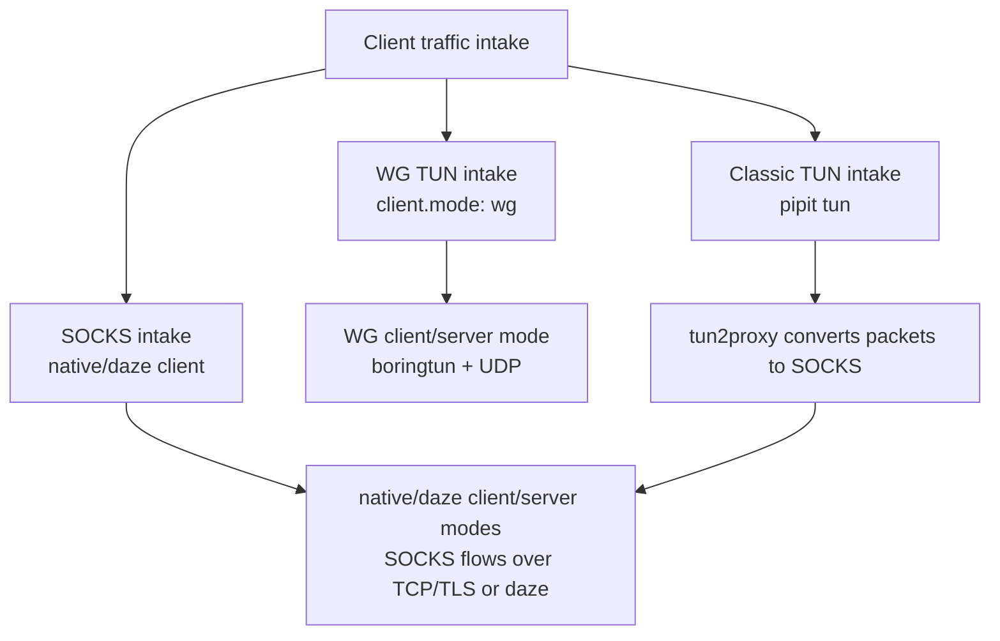
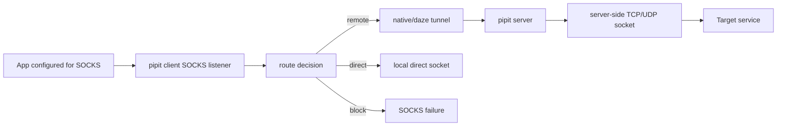
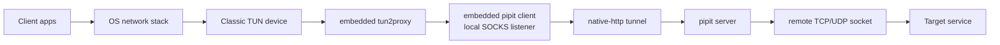

# `pipit` Architecture

This document describes the current `pipit` architecture after WG mode was added
as the recommended VPN-style path.

`pipit` is one binary with several entry points:

- `pipit client` / `pipit server`: the main client/server pair. The selected
  `mode` decides whether this is WG, native, or daze.
- `pipit tun`: the classic TUN-to-SOCKS path for the native-http client.
- `pipit wg-config`, `pipit wg-keygen`, `pipit wg-pubkey`: WG setup helpers.
- `pipit status`, `pipit stop`, `pipit tui`: daemon and telemetry operations.

## Mental Model

There are two separate questions:

- Client/server mode: how the client side talks to the server side.
- Client traffic intake: how local application traffic enters `pipit`.

WG is both a client/server mode and its own TUN-based traffic intake. The
native/daze modes expose a local SOCKS proxy, and `pipit tun` can put a TUN
device in front of the native-http SOCKS path.



## Recommended WG Data Path

WG mode is configured with `client.mode: wg` and `server.mode: wg`. It creates a
real WireGuard-style packet tunnel through `boringtun`.

```mermaid
flowchart LR
    A["Client apps"] --> B["OS network stack"]
    B --> C["Client WG TUN device"]
    C --> D["boringtun device engine"]
    D --> E["Encrypted UDP packets"]
    E --> F["Internet"]
    F --> G["Server UDP listen socket"]
    G --> H["boringtun device engine"]
    H --> I["Server WG TUN device"]
    I --> J["Linux forwarding + NAT"]
    J --> K["Target internet service"]
```



Implementation shape:

- `pipit client` dispatches to WG when `client.mode: wg`.
- `pipit server` dispatches to WG when `server.mode: wg`.
- `boringtun::device::DeviceHandle` owns the WireGuard-style TUN/UDP engine.
- `pipit` configures boringtun through its WireGuard UAPI socket under
  `/var/run/wireguard/<device>.sock`.
- Client hooks configure the local tunnel IP, MTU, endpoint bypass route,
  full-tunnel or split-tunnel routes, and optional DNS behavior.
- Server hooks configure the server tunnel IP, IP forwarding, forwarding rules,
  and optional IPv4 masquerade through `nat_out_interface`.
- A stats poller reads the UAPI counters and emits aggregate WG traffic samples
  into the shared telemetry/TUI path.

WG mode is the shortest hot path in `pipit`: packets enter the TUN device and
are encrypted as UDP packets directly. It does not use SOCKS, `tun2proxy`,
native-http, native-mux, or daze.

## Classic SOCKS Data Path

Native and daze modes are app-level proxy paths. They are useful when an
application can be pointed at a SOCKS proxy, when macOS system proxy is enough,
or when a specific native/daze transport shape is desired.



Supported client/server modes:

- `native-http`: TLS + HTTP-looking per-connection tunnel. This is also the mode
  used behind `pipit tun`.
- `native-mux`: one long-lived TLS session with logical streams.
- `daze-ashe`: raw TCP daze-style encrypted stream.
- `daze-baboon`: HTTP-looking daze request with fallback-site behavior.
- `daze-czar`: raw TCP multiplexed daze-style session.

The SOCKS path owns per-target routing policy:

- `proxy`: always use the remote server.
- `direct`: connect from the client machine.
- `rule`: evaluate hostname glob rules and CIDR rules, then fall back to remote.

## Classic `pipit tun` Data Path

`pipit tun` predates WG mode. It is still useful when we specifically want the
native-http SOCKS pipeline behind a TUN interface, but it is not the recommended
VPN-style path now that WG mode exists.



Key characteristics:

- `pipit tun` starts an embedded `pipit client`.
- Embedded `tun2proxy` converts captured packets into SOCKS-style TCP and UDP
  flows.
- The embedded client is forced to `client.mode: native-http`, because the TUN
  DNS/UDP behavior depends on SOCKS `UDP ASSOCIATE`.
- DNS has special handling in the native-http client path: TUN-redirected DNS
  can be forwarded through the remote tunnel instead of leaking to the local
  resolver.
- The hot path is longer than WG: `TUN -> tun2proxy -> SOCKS -> pipit client ->
  remote tunnel -> server -> target`.

## DNS And Domains

WG mode can see aggregate tunnel bytes by default, but packet encryption does
not expose destination domain names. TUI Recent Domains in WG mode requires DNS
capture:

- The client runs a local UDP DNS forwarder on `127.0.0.1:53`.
- macOS DNS can be temporarily pointed at that local forwarder.
- DNS query names are emitted to telemetry.
- Queries are forwarded to the configured upstream resolver through the tunnel.

Classic `pipit tun` has a separate DNS path inside the native-http client:

- TUN DNS traffic is redirected to the embedded client.
- TCP DNS can be forwarded through a remote TCP tunnel.
- UDP DNS can be converted into a remote TCP DNS exchange.

## Configuration Layout

WG settings live under `client.wg` and `server.wg`:

```yaml
client:
  mode: wg
  wg:
    endpoint: SERVER-IP:51820
    tunnel_ip: 10.8.0.2
    peer_tunnel_ip: 10.8.0.1
    allowed_ips:
      - 0.0.0.0/0

server:
  mode: wg
  wg:
    listen: 0.0.0.0:51820
    tunnel_ip: 10.8.0.1
    peer_tunnel_ip: 10.8.0.2
    peer_allowed_ips:
      - 10.8.0.2/32
```

The old top-level `wg_client` and `wg_server` sections are intentionally
rejected. Config precedence is still:

1. explicit CLI flags
2. environment variables
3. YAML config
4. built-in defaults

## Runtime Support

The same support systems are shared across modes:

- Logging uses `tracing` and `--log-file`.
- Daemon mode writes a role-specific pid file.
- Telemetry is emitted through a local socket.
- TUI can run inline or attach to an existing telemetry socket.
- Status checks combine pid-file and telemetry state.
- Hook plans can be printed before changing routes.

WG-specific runtime support:

- Preflight checks platform tools and privileges before hooks run.
- macOS auto device selection scans for free `utun` names.
- Linux defaults to `pipitwg0`.
- Cleanup hooks are guarded and run on shutdown.
- UAPI stats are converted to aggregate TUI traffic samples.

## Current Limits

- WG automatic hooks support IPv4-only or IPv6-only tunnel pairs. A single
  config with both IPv4 and IPv6 tunnel pairs still needs a schema extension.
- Linux server NAT defaults are IPv4-oriented. IPv6 forwarding/NAT requires
  explicit network design.
- WG mode is standard WireGuard-style UDP through `boringtun`; it is not
  AmneziaWG obfuscation.
- Real TUN, route, forwarding, and NAT changes usually require root or
  equivalent network privileges.

## Code Map

- CLI dispatch and service lifecycle: `src/main.rs`
- Mode enum: `src/mode.rs`
- YAML config loading and precedence: `src/config.rs`
- WG mode: `src/wg/`
- WG client/server entry points: `src/wg/client.rs`, `src/wg/server.rs`
- WG hooks: `src/wg/hooks.rs`
- WG UAPI and stats: `src/wg/uapi.rs`, `src/wg/stats.rs`
- WG DNS capture: `src/wg/dns.rs`
- Classic SOCKS client path: `src/client.rs`
- Classic server path: `src/server.rs`
- Classic TUN path: `src/tun.rs`
- SOCKS UDP handling: `src/udp_assoc.rs`
- Telemetry and TUI: `src/telemetry.rs`, `src/tui.rs`
