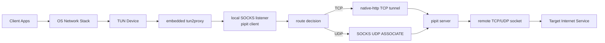
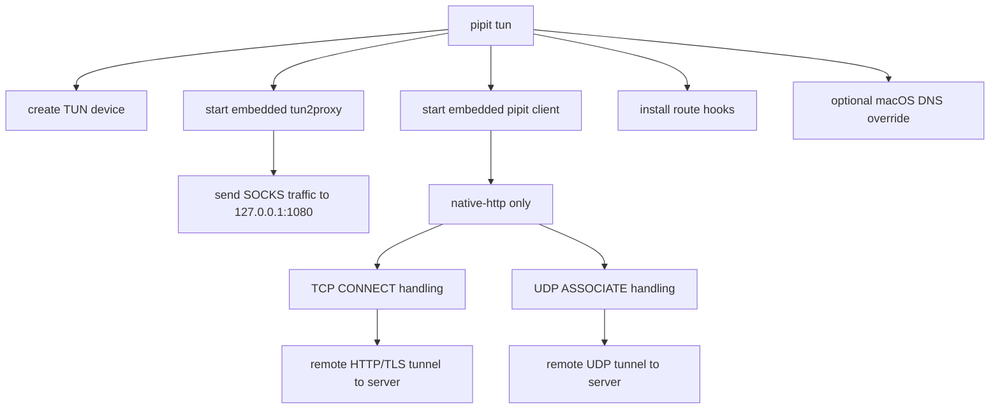

# Current `pipit` Architecture

This sketch focuses on the current `pipit tun` data path, because that is the path we have been discussing for performance and future `boringtun` integration.

At the moment, `pipit tun` is not a native packet VPN. It is a TUN-to-proxy stack:

- `TUN` traffic is captured locally.
- Embedded `tun2proxy` converts packets into SOCKS-style TCP and UDP flows.
- The embedded `pipit client` accepts those flows on a local SOCKS listener.
- The client opens a remote tunnel to `pipit server`.
- The server then opens the final TCP or UDP socket to the destination.

## High-Level Flow

## Tun-Specific Details

## DNS Path Today

DNS is now handled as a special case inside the existing proxy stack:

- Tun-redirected `TCP 198.18.0.1:53` is intercepted by the client and forwarded through a remote TCP tunnel to the real `dns_upstream`.
- Tun-redirected `UDP DNS` is intercepted in `udp_assoc` and converted into remote TCP DNS exchange, instead of using the older remote UDP DNS path.

That means DNS is no longer just "whatever tun2proxy gives us"; it is now an explicit branch inside the client.

## Main Characteristics

- Strengths:
  - Reuses the existing `pipit client` and `pipit server`.
  - Keeps one operational model for logs, daemon mode, TUI, and config.
  - Makes it easy to keep adding per-flow routing logic in user space.

- Costs:
  - The TUN path is long: `TUN -> tun2proxy -> SOCKS -> pipit client -> remote tunnel -> server -> target`.
  - UDP is a second-class path compared with a native packet VPN.
  - `tun` currently depends on `client.mode = native-http`, which keeps the design tied to the proxy stack.
  - Performance and latency are shaped by per-flow proxy behavior rather than by a native encrypted packet tunnel.

## Relevant Code

- `tun` lifecycle: `src/tun.rs`
- local SOCKS client path: `src/client.rs`
- UDP association and remote UDP handling: `src/udp_assoc.rs`
- server-side tunnel termination: `src/server.rs`
