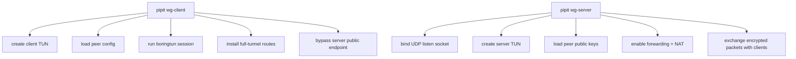

# Future `pipit + boringtun` Architecture

This sketch describes the minimal future architecture if we add a new WireGuard-style path built on `boringtun`.

The core idea is to stop treating `tun` as "proxy traffic in a TUN wrapper" and instead introduce a real packet tunnel mode.

## Target Direction

- Add a new `wg` mode instead of replacing the current `native-http` stack.
- Keep the current proxy-based modes for compatibility.
- Use `boringtun` as the WireGuard protocol engine.
- Let the operating system handle forwarding and NAT on the server side.

## High-Level Flow

## Control and Setup View

## Main Difference From Today

Today:

- packets enter TUN
- packets are translated into proxy flows
- flows are re-encapsulated into `pipit` tunnels

Future with `boringtun`:

- packets enter TUN
- packets are encrypted as WireGuard packets
- encrypted UDP packets go directly to the server
- decrypted packets are reinjected into the server-side network stack

That removes these middle layers from the hot path:

- embedded `tun2proxy`
- local SOCKS listener
- per-flow TCP/UDP proxy translation
- remote HTTP tunnel setup for ordinary traffic

## Minimal Implementation Boundary

Client responsibilities:

- open and read/write the client TUN
- maintain one or more WireGuard peers via `boringtun`
- send encrypted UDP packets to the server
- receive encrypted UDP packets and write decrypted IP packets back to TUN

Server responsibilities:

- listen on UDP
- decrypt client packets with `boringtun`
- write decrypted packets to the server TUN
- let the OS route and NAT outbound traffic
- read return traffic from server TUN, encrypt it, and send it back to the client

## Why This Helps

- Shorter data path for `tun`
- Better fit for UDP and QUIC traffic
- Lower per-flow overhead
- Architecture is closer to a real VPN, which is the same broad direction that makes Amnezia-style systems feel faster and more native than a proxy-wrapped TUN design

## Important Limitation

This future architecture would be closer to standard WireGuard than to AmneziaWG.

So it improves the transport model and likely improves performance, but it does not automatically provide:

- protocol impersonation
- junk packet obfuscation
- QUIC-like or DNS-like disguise
- active-probing resistance

Those would need a later obfuscation layer or a deeper protocol modification.

## Suggested Module Split

- `src/wg/mod.rs`
- `src/wg/client.rs`
- `src/wg/server.rs`
- `src/wg/tunio.rs`
- `src/wg/udpio.rs`
- `src/wg/config.rs`
- `src/tun_common.rs`

## Migration Strategy

1. Keep the current `pipit tun` path unchanged.
2. Add a new experimental `wg` mode beside it.
3. Reuse route, logging, daemon, and TUI infrastructure where possible.
4. Only after the `wg` mode is stable, decide whether to add an Amnezia-style obfuscation layer on top.
